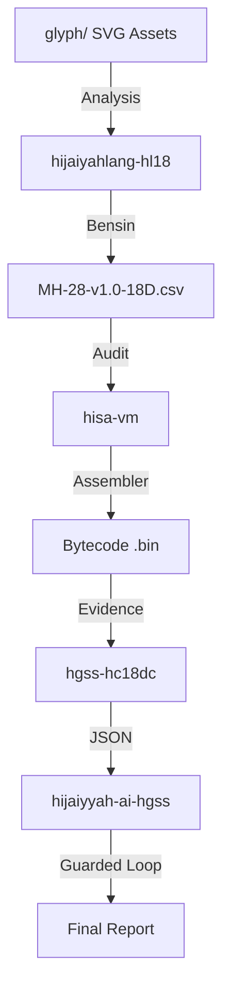

# REPO MAP — Hijaiyah-Codex

This document maps the relationships between assets and modules in the `hijaiyah-codex` ecosystem.

## 1. Data Flow Architecture
The system follows a strict pipeline from visual glyphs to audit-grade reports:

## 2. Tooling & Entrypoints

| Module | Core Responsibility | Makefile Target |
| :--- | :--- | :--- |
| **Root** | Monorepo Orchestration | `make all` |
| `glyph/` | SVG & Raster Glyphs | - |
| `hisa-vm` | Deterministic VM Engine | `make test` |
| `hgss-hc18dc` | Normative Ground-Truth | `make demo` |
| `hijaiyyah-ai-hgss` | Industrial AI Compliance | `make demo` |
| `csgi/` | Geometry-to-Feature Interface | - |
| `scripts/audit` | Forensic Integrity & Manifests | - |
| `scripts/validation` | Conformance Validators | - |
| `scripts/generators` | Dataset & Table synthesis | - |
| `scripts/debug` | Trace & Manual debugging | - |
| `scripts/infra` | Docker & Environment orchestration | - |

## 3. Normative Assets
- **Primary Bensin**: `MH-28-v1.0-18D.csv` (Root)
- **Legacy & Tests**: `data/legacy/`
- **Math Assets**: `cmm18c/math_assets/`
- **Geometry Interface**: `csgi/CSGI-28-v1.0.json`
- **Oracle Lock**: Frozen at `HGSS-HCVM-v1.HC18DC`.
